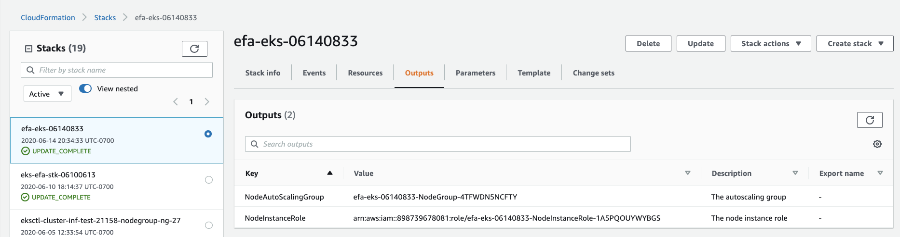

# Getting started with EFA on EKS


## EFA Basics

Please read https://docs.aws.amazon.com/AWSEC2/latest/UserGuide/efa.html for basic knowledge of EFA

## Kubernetes and EKS Basics

This document is assuming user has basic knowledge on [Kubernetes](https://kubernetes.io/docs/tutorials/kubernetes-basics/) and Amazon [EKS](https://docs.aws.amazon.com/eks/latest/userguide/what-is-eks.html)

## Abstract

This document will introduce the user to create an EKS cluster with `P3dn.24xlarge` backed nodegroup with EFA, to run an example NCCL-Test for Multi-node NCCL Performance via EFA. This workflow will also provide a template for distributed deep learning training on EKS using EFA.


## Step 1: Create EKS cluster

Create an empty EKS cluster via `eksctl`, at the moment, `eksctl` doesnt have support to create EFA supported nodegroup. In the later steps, the nodegroup would be created then join the EKS cluster.

```
eksctl create cluster --name=${cluster_name} \
 --region=us-west-2 \
 --ssh-access --ssh-public-key ~/.ssh/id_rsa.pub \
 --without-nodegroup
```


## Step 2: Prepare an EFA-enable security group

Create an EFA-enabled security group via [https://console.aws.amazon.com/ec2/**](https://console.aws.amazon.com/ec2/).

Select the VPC into which the EKS cluster located in.

On the **Inbound** and **Outbound** tabs, do the following:

* Choose **Edit**.
* For **Type**, choose **All traffic**.
* For **Source**, choose **Custom**.
* Paste the security group ID that you copied into the field (EFA-enable security group you created).
* Choose **Save**.


## Step 3: Launch EKS nodes into cluster

Follow steps in [Launching self-managed Amazon Linux nodes](https://docs.aws.amazon.com/eks/latest/userguide/launch-workers.html) to create EFA enable node group.

Currently, you need to use `AWS Managed Console` to create node group, we will support in eksctl for fast and easy bootstrap in the future.

- **Specify Template**, select **Upload Template** then use nodegroup template in [assets/efa-nodegroup.yaml](assets/efa-nodegroup.yaml)
- In `ClusterControlPlaneSecurityGroup`, use the control plan security group (the name contains `control plan`) which is automatically created by EKS when user created via eksctl.
- In `NodeImageIdSSMParam`, ensure it is using Amazon EKS-optimized accelerated AMI: `/aws/service/eks/optimized-ami/1.16/amazon-linux-2-gpu/recommended/image_id`.
- In `NodeAutoScalingGroupDesiredCapacity`, it is recommended to have `2` nodes.
- In `Subnetid`, it is recommended to put in a public subnet.

Waiting for stack creation finished.

**To enable worker nodes to join your cluster:** 

Use the following command to download the configuration map:

```
curl -o aws-auth-cm.yaml https://amazon-eks.s3.us-west-2.amazonaws.com/cloudformation/2020-06-10/aws-auth-cm.yaml
```

Open the file with your favorite text editor. Replace the `<ARN of instance role (not instance profile)>` snippet with the **NodeInstanceRole** value that you recorded in the previous procedure, and save the file.

The **NodeInstanceRole** would be found in `CloudFormation > Stacks > <Stacks just created>: Outputs tab`, as the screenshots below:


```
apiVersion: v1
kind: ConfigMap
metadata:
  name: aws-auth
  namespace: kube-system
data:
  mapRoles: |
    - rolearn: <ARN of instance role (not instance profile)>
      username: system:node:{{EC2PrivateDNSName}}
      groups:
        - system:bootstrappers
        - system:nodes
```


Apply the configuration. This command may take a few minutes to finish.

```
kubectl apply -f aws-auth-cm.yaml
```

Watch the status of your nodes and wait for them to reach the `Ready` status.

```
kubectl get nodes --watch
```

The command would return nodes information, as the following shows.

```
NAME STATUS ROLES AGE VERSION
ip-192-168-16-52.us-west-2.compute.internal Ready <none> 4d21h v1.16.8-eks-e16311
ip-192-168-2-54.us-west-2.compute.internal Ready <none> 4d21h v1.16.8-eks-e16311
```

`p3dn` is a GPU instance type and the Amazon EKS-optimized accelerated AMI, you must apply the [NVIDIA device plugin for Kubernetes](https://github.com/NVIDIA/k8s-device-plugin) as a DaemonSet on your cluster with the following command. 

Nvidia GPU device plugin is recommended for NCCL-test which runs later.

```
kubectl apply -f https://raw.githubusercontent.com/NVIDIA/k8s-device-plugin/v0.6.0/nvidia-device-plugin.yml
```


**Add the nodes into EFA-enable security group created in Step 2**

**To verify Security Group in Node Instances:**
Go to EC2 Dashboard - AWS Console, add the EFA-enable security group in Step2 to the node instances in the EKS cluster,  verify the Inbound and Outbound rules of each node instance meet requirements:

**Inbound** and **Outbound** tabs

* For **Type**, it is **All traffic**
* For **Source**, it is **Custom, with** the security group ID that you copied into the field from control plan security group created with EKS cluster and `EFA-enabled group` created in Step 2.


## Step 4: Verify EFA is enabled in nodes

The nodegroup template contains bootstrap to install EFA drivers in node:

Confirm that the EFA drivers components were successfully installed, please use  `SSH`  to connect to each of the node instance which joined the cluster in Step 3, run the command to ensure that the kernel modules are loaded correctly.

```
fi_info -p efa
```

The command should return information about the Libfabric EFA interfaces. The following example shows the command output.


```
provider: efa
    fabric: EFA-fe80::94:3dff:fe89:1b70
    domain: efa_0-rdm
    version: 2.0
    type: FI_EP_RDM
    protocol: FI_PROTO_EFA
provider: efa
    fabric: EFA-fe80::94:3dff:fe89:1b70
    domain: efa_0-dgrm
    version: 2.0
    type: FI_EP_DGRAM
    protocol: FI_PROTO_EFA
provider: efa;ofi_rxd
    fabric: EFA-fe80::94:3dff:fe89:1b70
    domain: efa_0-dgrm
    version: 1.0
    type: FI_EP_RDM
    protocol: FI_PROTO_RXD
```

If the command get outputs unexpected, try to reinstall EFA drivers in EC2 node, this installation is already included in bootstramp in the nodegroup template used above:

```
#! /bin/bash

# Set EFA version
EFA_VERSION=1.9.3 # or latest

# Download and install EFA driver
curl -O  https://s3-us-west-2.amazonaws.com/aws-efa-installer/aws-efa-installer-${EFA_VERSION}.tar.gz

tar -xf aws-efa-installer-${EFA_VERSION}.tar.gz

cd aws-efa-installer

sudo ./efa_installer.sh -y

sudo sed -i 's/kernel.yama.ptrace_scope = 1/kernel.yama.ptrace_scope = 0/g' \
    /etc/sysctl.d/10-ptrace.conf
```


## Step 5: Build Dockerfile

Please use the Dockerfile: `/dockerfile/Dockerfile-NCCL-test-for-EKS-EFA-v1.0` to build the image, which contains essentials for adopting EFA in pod, for Multi-node NCCL Performance Test

**Note for users who need to build self-image for further work:**

If you want to build self-image for future advanced work, please refer to Dockerfile-v1.0:

The **minimum** packages required in docker image to recognize mounted EFA device are:

* `aws-efa-installer`  would contain necessary packages `Libfabric` and `Open MPI`

For running `NCCL-test` to verify EFA is working in container or pod level,  the following packages are also considered to necessary in docker image

* `Nvidia GPU drivers` and `Nvidia CUDA Toolkit`
* `NCCL` : NCCL (pronounced "Nickel") is a stand-alone library of standard collective communication routines for GPUs, implementing all-reduce, all-gather, reduce, broadcast, and reduce-scatter. For more information about NCCL, see the [NCCL repository](https://github.com/NVIDIA/nccl)
* `aws-ofi-nccl:` The plugin maps NCCL's connection-oriented transport APIs to Libfabric's connection-less reliable interface. This enables you to use Libfabric as a network provider while running NCCL-based applications. For more information about the aws-ofi-nccl plugin, see the [aws-ofi-nccl-repository](https://github.com/aws/aws-ofi-nccl)

`Horovod` and `Tensorflow`  is not minimum viable to be included in Dockerfile for EKS customer to use EFA. But if customer want to run Machine Learning work on Tensorflow and Horovod,  those Machine Learning related libraries could be included by customer requirement into Dockerfile.

**In Node (instance)**
On node instance with single EFA device, we would mount EFA device as a [`hostPath`](https://kubernetes.io/docs/concepts/storage/volumes/#hostpath) volume to Kubernetes, the driver: 
`aws-efa-installer`  (as Step 4 installation above) is required to be verified installed successfully in node instance, or the EFA device won’t be mounted correctly in Kubernetes.


## Step 6: Install Kubeflow MPI-Operator
To run this example we will need to install the Kubeflow MPI Operator:

```
git clone https://github.com/kubeflow/mpi-operator
cd mpi-operator
kubectl create -f deploy/v1alpha2/mpi-operator.yaml
```


## Step 7: Run Multi-node NCCL Performance Test on EKS cluster for verifying EFA

To check NCCL Performance with EFA, run the standard NCCL Performance test that is available on the official [NCCL-Tests Repo](https://github.com/NVIDIA/nccl-tests.git). The Dockerfile comes with this test already built for both CUDA 10.2. You can similarly run Kubernetes job with EFA.

**HugePages**
The most important modification required in Kubernetes job for adopting EFA is configuring and managing [Huge Pages](https://kubernetes.io/docs/tasks/manage-hugepages/scheduling-hugepages/) as a schedulable resource in the cluster. Currently, nodes with EFA support pre-allocates 5128 2M Huge Pages.

The example to run 2 node NCCL Performance Test  is `example-jobs/mpi-nccl-test.yaml`.  In the example NCCL-test job, each worker requested 8 gpus which would allow cluster to allocate two nodes in two p3dn instances,  and also 256Mi hugepages-2Mi and 8000Mi.

Note: 

- Under`example-jobs`, there are multiple examples using EFA with EKS jobs
- Under `logs` , there are several logs from NCCL-test jobs and Tensorflow-benchmark jobs with different parameters

Create NCCL-tests job via command:

```
$ kubectl create -f mpi-nccl-debug.yaml
mpijob.kubeflow.org/nccl-test-debug created
```

Check status of pods via command:

```
$ kubectl get pods -w
NAMESPACE      NAME                                   READY   STATUS     RESTARTS   AGE
default        nccl-test-debug-launcher-5dw9b         0/1     Init:0/1   0          5s
default        nccl-test-debug-worker-0               1/1     Running    0          5s
default        nccl-test-debug-worker-1               1/1     Running    0          5s
default        nccl-test-debug-launcher-5dw9b         0/1     PodInitializing   0          5s
default        nccl-test-debug-launcher-5dw9b         1/1     Running           0          6s
```


The whole log you would read should be similar as below, the communication through EFA would be verfied via log:

```
ip-192-168-2-54:14:20 [0] NCCL INFO Ring 01 : 0[160] -> 1[160] [send] via NET/AWS Libfabric/0
ip-192-168-16-52:14:19 [0] NCCL INFO Ring 01 : 0[160] -> 1[160] [receive] via NET/AWS Libfabric/0
```

The whole log returned by command:

```
$ kubectl logs -f nccl-test-debug-launcher-cnxb8
```

<details>
<summary>Click to check details logs</summary>

```
+ POD_NAME=nccl-test-debug-worker-0
+ shift
+ /opt/kube/kubectl exec nccl-test-debug-worker-0 -- /bin/sh -c        PATH=/opt/amazon/openmpi/bin:$PATH ; export PATH ; LD_LIBRARY_PATH=/opt/amazon/openmpi/lib:$LD_LIBRARY_PATH ; export LD_LIBRARY_PATH ; DYLD_LIBRARY_PATH=/opt/amazon/openmpi/lib:$DYLD_LIBRARY_PATH ; export DYLD_LIBRARY_PATH ;   /opt/amazon/openmpi/bin/orted -mca ess "env" -mca ess_base_jobid "2727411712" -mca ess_base_vpid 1 -mca ess_base_num_procs "3" -mca orte_node_regex "ip-[3:192]-168-2-54,nccl-test-debug-worker-[1:0-1]@0(3)" -mca orte_hnp_uri "2727411712.0;tcp://192.168.2.54:48487" --mca plm_rsh_no_tree_spawn "1" --mca pml "ob1" --mca mtl "ofi" --mca mtl_ofi_provider_include "efa" --mca oob_tcp_if_include "eth0" --mca btl_tcp_if_include "eth0" -mca plm "rsh" -mca orte_default_hostfile "/etc/mpi/hostfile" -mca plm_rsh_agent "/etc/mpi/kubexec.sh" -mca rmaps_ppr_n_pernode "1" -mca hwloc_base_binding_policy "none" -mca rmaps_base_oversubscribe "1" -mca pmix "^s1,s2,cray,isolated"
+ POD_NAME=nccl-test-debug-worker-1
+ shift
+ /opt/kube/kubectl exec nccl-test-debug-worker-1 -- /bin/sh -c        PATH=/opt/amazon/openmpi/bin:$PATH ; export PATH ; LD_LIBRARY_PATH=/opt/amazon/openmpi/lib:$LD_LIBRARY_PATH ; export LD_LIBRARY_PATH ; DYLD_LIBRARY_PATH=/opt/amazon/openmpi/lib:$DYLD_LIBRARY_PATH ; export DYLD_LIBRARY_PATH ;   /opt/amazon/openmpi/bin/orted -mca ess "env" -mca ess_base_jobid "2727411712" -mca ess_base_vpid 2 -mca ess_base_num_procs "3" -mca orte_node_regex "ip-[3:192]-168-2-54,nccl-test-debug-worker-[1:0-1]@0(3)" -mca orte_hnp_uri "2727411712.0;tcp://192.168.2.54:48487" --mca plm_rsh_no_tree_spawn "1" --mca pml "ob1" --mca mtl "ofi" --mca mtl_ofi_provider_include "efa" --mca oob_tcp_if_include "eth0" --mca btl_tcp_if_include "eth0" -mca plm "rsh" -mca orte_default_hostfile "/etc/mpi/hostfile" -mca plm_rsh_agent "/etc/mpi/kubexec.sh" -mca rmaps_ppr_n_pernode "1" -mca hwloc_base_binding_policy "none" -mca rmaps_base_oversubscribe "1" -mca pmix "^s1,s2,cray,isolated"
# nThread 1 nGpus 1 minBytes 8 maxBytes 2147483648 step: 2(factor) warmup iters: 5 iters: 1000 validation: 1
#
# Using devices
#   Rank  0 Pid     14 on ip-192-168-2-54 device  0 [0x00] Tesla V100-SXM2-32GB
#   Rank  1 Pid     14 on ip-192-168-16-52 device  0 [0x00] Tesla V100-SXM2-32GB
ip-192-168-2-54:14:14 [0] NCCL INFO Bootstrap : Using [0]eth0:192.168.2.54<0> [1]eth1:192.168.26.253<0> [2]eni5f53594ade6:fe80::8414:79ff:fe3e:236b%eni5f53594ade6<0> [3]eni0f5821326e4:fe80::9473:48ff:fe6b:8179%eni0f5821326e4<0>
ip-192-168-2-54:14:14 [0] NCCL INFO NET/OFI Setting RDMAV_FORK_SAFE environment variable to 1.
ip-192-168-2-54:14:14 [0] NCCL INFO NET/OFI Forcing AWS OFI ndev 4
ip-192-168-2-54:14:14 [0] NCCL INFO NET/OFI Selected Provider is efa
ip-192-168-2-54:14:14 [0] NCCL INFO NET/Plugin: Failed to find ncclCollNetPlugin_v3 symbol.
ip-192-168-2-54:14:14 [0] NCCL INFO Using network AWS Libfabric
ip-192-168-16-52:14:14 [0] NCCL INFO Bootstrap : Using [0]eth0:192.168.16.52<0> [1]eth1:192.168.17.247<0> [2]enie431cb6619d:fe80::4c57:3aff:fe13:2250%enie431cb6619d<0> [3]eniafaadf43014:fe80::4082:1cff:feb9:d132%eniafaadf43014<0> [4]enica9b6b5061d:fe80::d8b3:d0ff:fe59:e834%enica9b6b5061d<0> [5]enia6b940cb1cb:fe80::a096:4dff:feeb:ab3f%enia6b940cb1cb<0> [6]eni7a56b1293b9:fe80::dc06:caff:feff:7c81%eni7a56b1293b9<0>
ip-192-168-16-52:14:14 [0] NCCL INFO NET/OFI Setting RDMAV_FORK_SAFE environment variable to 1.
NCCL version 2.6.4+cuda10.2
ip-192-168-16-52:14:14 [0] NCCL INFO NET/OFI Forcing AWS OFI ndev 4
ip-192-168-16-52:14:14 [0] NCCL INFO NET/OFI Selected Provider is efa
ip-192-168-16-52:14:14 [0] NCCL INFO NET/Plugin: Failed to find ncclCollNetPlugin_v3 symbol.
ip-192-168-16-52:14:14 [0] NCCL INFO Using network AWS Libfabric
ip-192-168-2-54:14:20 [0] NCCL INFO NET/OFI [0] getCudaPath dev 0 busId 0000:00:16.0 path /sys/devices/pci0000:00/
ip-192-168-2-54:14:20 [0] NCCL INFO NET/OFI [0] getCudaPath dev 1 busId 0000:00:17.0 path /sys/devices/pci0000:00
ip-192-168-16-52:14:19 [0] NCCL INFO NET/OFI [0] getCudaPath dev 0 busId 0000:00:16.0 path /sys/devices/pci0000:00/
ip-192-168-16-52:14:19 [0] NCCL INFO NET/OFI [0] getCudaPath dev 1 busId 0000:00:17.0 path /sys/devices/pci0000:00
ip-192-168-2-54:14:20 [0] NCCL INFO NET/OFI [0] getCudaPath dev 2 busId 0000:00:18.0 path /sys/devices/pci0000:00
ip-192-168-16-52:14:19 [0] NCCL INFO NET/OFI [0] getCudaPath dev 2 busId 0000:00:18.0 path /sys/devices/pci0000:00
ip-192-168-16-52:14:19 [0] NCCL INFO NET/OFI [0] getCudaPath dev 3 busId 0000:00:19.0 path /sys/devices/pci0000:00
ip-192-168-2-54:14:20 [0] NCCL INFO NET/OFI [0] getCudaPath dev 3 busId 0000:00:19.0 path /sys/devices/pci0000:00
ip-192-168-2-54:14:20 [0] NCCL INFO NET/OFI [0] getCudaPath dev 0 busId 0000:00:16.0 path /sys/devices/pci0000:00/
ip-192-168-2-54:14:20 [0] NCCL INFO NET/OFI [0] getCudaPath dev 1 busId 0000:00:17.0 path /sys/devices/pci0000:00
ip-192-168-2-54:14:20 [0] NCCL INFO NET/OFI [0] getCudaPath dev 2 busId 0000:00:18.0 path /sys/devices/pci0000:00
ip-192-168-2-54:14:20 [0] NCCL INFO NET/OFI [0] getCudaPath dev 3 busId 0000:00:19.0 path /sys/devices/pci0000:00
ip-192-168-16-52:14:19 [0] NCCL INFO NET/OFI [0] getCudaPath dev 0 busId 0000:00:16.0 path /sys/devices/pci0000:00/
ip-192-168-16-52:14:19 [0] NCCL INFO NET/OFI [0] getCudaPath dev 1 busId 0000:00:17.0 path /sys/devices/pci0000:00
ip-192-168-16-52:14:19 [0] NCCL INFO NET/OFI [0] getCudaPath dev 2 busId 0000:00:18.0 path /sys/devices/pci0000:00
ip-192-168-16-52:14:19 [0] NCCL INFO NET/OFI [0] getCudaPath dev 3 busId 0000:00:19.0 path /sys/devices/pci0000:00
ip-192-168-2-54:14:20 [0] NCCL INFO Channel 00/04 :    0   1
ip-192-168-2-54:14:20 [0] NCCL INFO Channel 01/04 :    0   1
ip-192-168-2-54:14:20 [0] NCCL INFO Channel 02/04 :    0   1
ip-192-168-2-54:14:20 [0] NCCL INFO Channel 03/04 :    0   1
ip-192-168-2-54:14:20 [0] NCCL INFO threadThresholds 8/8/64 | 16/8/64 | 8/8/64
ip-192-168-2-54:14:20 [0] NCCL INFO Trees [0] 1/-1/-1->0->-1|-1->0->1/-1/-1 [1] 1/-1/-1->0->-1|-1->0->1/-1/-1 [2] -1/-1/-1->0->1|1->0->-1/-1/-1 [3] -1/-1/-1->0->1|1->0->-1/-1/-1
ip-192-168-16-52:14:19 [0] NCCL INFO threadThresholds 8/8/64 | 16/8/64 | 8/8/64
ip-192-168-16-52:14:19 [0] NCCL INFO Trees [0] -1/-1/-1->1->0|0->1->-1/-1/-1 [1] -1/-1/-1->1->0|0->1->-1/-1/-1 [2] 0/-1/-1->1->-1|-1->1->0/-1/-1 [3] 0/-1/-1->1->-1|-1->1->0/-1/-1
ip-192-168-2-54:14:20 [0] NCCL INFO Ring 00 : 1[160] -> 0[160] [receive] via NET/AWS Libfabric/0
ip-192-168-16-52:14:19 [0] NCCL INFO Ring 00 : 0[160] -> 1[160] [receive] via NET/AWS Libfabric/0
ip-192-168-2-54:14:20 [0] NCCL INFO Ring 00 : 0[160] -> 1[160] [send] via NET/AWS Libfabric/0
ip-192-168-16-52:14:19 [0] NCCL INFO Ring 00 : 1[160] -> 0[160] [send] via NET/AWS Libfabric/0
ip-192-168-2-54:14:20 [0] NCCL INFO Ring 01 : 1[160] -> 0[160] [receive] via NET/AWS Libfabric/0
ip-192-168-2-54:14:20 [0] NCCL INFO Ring 01 : 0[160] -> 1[160] [send] via NET/AWS Libfabric/0
ip-192-168-16-52:14:19 [0] NCCL INFO Ring 01 : 0[160] -> 1[160] [receive] via NET/AWS Libfabric/0
ip-192-168-16-52:14:19 [0] NCCL INFO Ring 01 : 1[160] -> 0[160] [send] via NET/AWS Libfabric/0
ip-192-168-16-52:14:19 [0] NCCL INFO Ring 02 : 0[160] -> 1[160] [receive] via NET/AWS Libfabric/0
ip-192-168-2-54:14:20 [0] NCCL INFO Ring 02 : 1[160] -> 0[160] [receive] via NET/AWS Libfabric/0
ip-192-168-16-52:14:19 [0] NCCL INFO Ring 02 : 1[160] -> 0[160] [send] via NET/AWS Libfabric/0
ip-192-168-2-54:14:20 [0] NCCL INFO Ring 02 : 0[160] -> 1[160] [send] via NET/AWS Libfabric/0
ip-192-168-16-52:14:19 [0] NCCL INFO Ring 03 : 0[160] -> 1[160] [receive] via NET/AWS Libfabric/0
ip-192-168-16-52:14:19 [0] NCCL INFO Ring 03 : 1[160] -> 0[160] [send] via NET/AWS Libfabric/0
ip-192-168-2-54:14:20 [0] NCCL INFO Ring 03 : 1[160] -> 0[160] [receive] via NET/AWS Libfabric/0
ip-192-168-2-54:14:20 [0] NCCL INFO Ring 03 : 0[160] -> 1[160] [send] via NET/AWS Libfabric/0
ip-192-168-2-54:14:20 [0] NCCL INFO comm 0x7f6f48000dc0 rank 0 nranks 2 cudaDev 0 busId 160 - Init COMPLETE
ip-192-168-16-52:14:19 [0] NCCL INFO comm 0x7f79b0000dc0 rank 1 nranks 2 cudaDev 0 busId 160 - Init COMPLETE
#
#                                                     out-of-place                       in-place
#       size         count    type   redop     time   algbw   busbw  error     time   algbw   busbw  error
#        (B)    (elements)                     (us)  (GB/s)  (GB/s)            (us)  (GB/s)  (GB/s)
ip-192-168-2-54:14:14 [0] NCCL INFO Launch mode Parallel
           8             2   float     sum    52.16    0.00    0.00  0e+00    52.04    0.00    0.00  0e+00
          16             4   float     sum    52.04    0.00    0.00  0e+00    51.83    0.00    0.00  0e+00
          32             8   float     sum    51.91    0.00    0.00  0e+00    51.74    0.00    0.00  0e+00
          64            16   float     sum    52.22    0.00    0.00  0e+00    51.91    0.00    0.00  0e+00
         128            32   float     sum    52.48    0.00    0.00  0e+00    52.36    0.00    0.00  0e+00
         256            64   float     sum    53.16    0.00    0.00  0e+00    52.94    0.00    0.00  0e+00
         512           128   float     sum    54.36    0.01    0.01  0e+00    54.34    0.01    0.01  0e+00
        1024           256   float     sum    58.65    0.02    0.02  0e+00    58.28    0.02    0.02  0e+00
        2048           512   float     sum    60.24    0.03    0.03  0e+00    59.99    0.03    0.03  0e+00
        4096          1024   float     sum    63.42    0.06    0.06  0e+00    63.17    0.06    0.06  0e+00
        8192          2048   float     sum    69.16    0.12    0.12  0e+00    69.00    0.12    0.12  0e+00
       16384          4096   float     sum    76.86    0.21    0.21  0e+00    76.56    0.21    0.21  0e+00
       32768          8192   float     sum    95.57    0.34    0.34  0e+00    95.95    0.34    0.34  0e+00
       65536         16384   float     sum    137.5    0.48    0.48  0e+00    137.6    0.48    0.48  0e+00
      131072         32768   float     sum    176.4    0.74    0.74  0e+00    175.7    0.75    0.75  0e+00
      262144         65536   float     sum    239.2    1.10    1.10  0e+00    240.2    1.09    1.09  0e+00
      524288        131072   float     sum    345.3    1.52    1.52  0e+00    343.7    1.53    1.53  0e+00
     1048576        262144   float     sum    558.9    1.88    1.88  0e+00    555.9    1.89    1.89  0e+00
     2097152        524288   float     sum    998.5    2.10    2.10  0e+00   1020.4    2.06    2.06  0e+00
     4194304       1048576   float     sum   1806.7    2.32    2.32  0e+00   1833.3    2.29    2.29  0e+00
     8388608       2097152   float     sum   3431.5    2.44    2.44  0e+00   3442.4    2.44    2.44  0e+00
    16777216       4194304   float     sum   6940.6    2.42    2.42  0e+00   6899.4    2.43    2.43  0e+00
    33554432       8388608   float     sum    13602    2.47    2.47  0e+00    13578    2.47    2.47  0e+00
    67108864      16777216   float     sum    26640    2.52    2.52  0e+00    26545    2.53    2.53  0e+00
   134217728      33554432   float     sum    52300    2.57    2.57  0e+00    52459    2.56    2.56  0e+00
   268435456      67108864   float     sum   104247    2.57    2.57  0e+00   103832    2.59    2.59  0e+00
   536870912     134217728   float     sum   207687    2.59    2.59  0e+00   207606    2.59    2.59  0e+00
  1073741824     268435456   float     sum   413610    2.60    2.60  0e+00   414275    2.59    2.59  0e+00
  2147483648     536870912   float     sum   826687    2.60    2.60  0e+00   828420    2.59    2.59  0e+00
# Out of bounds values : 0 OK
# Avg bus bandwidth    : 1.16154
```
</details>

## Security

See [CONTRIBUTING](CONTRIBUTING.md#security-issue-notifications) for more information.

## License

This project is licensed under the Apache-2.0 License.

